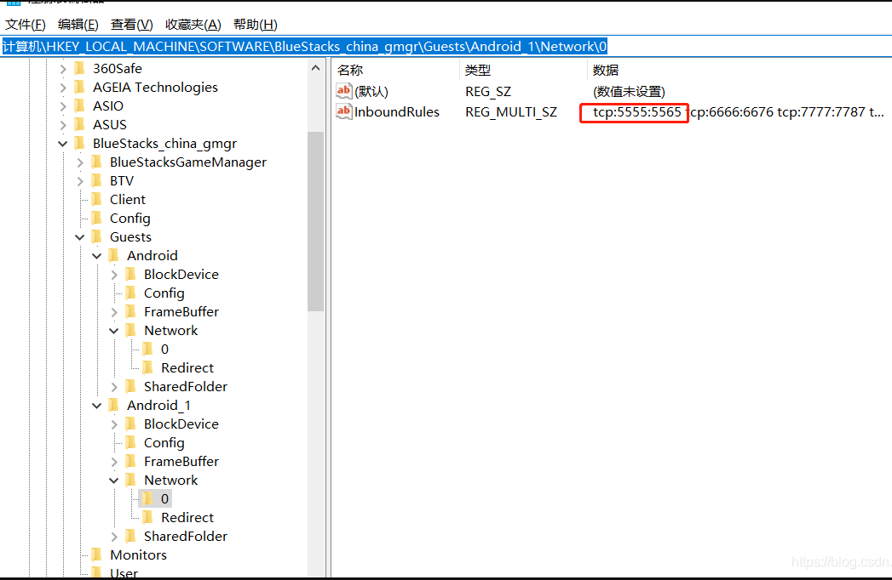

# 其他开发工具

slug: develop_tool
status: Published
tags: 开发工具
type: Post

# 

### beyond compare

```
方法一：
修改C:\Program Files\Beyond Compare 4\BCUnrar.dll,这个文件重命名或者直接删除，则会新增30天试用期，再次打开提示还有28天试用期
方法二：
1.cmd窗口输入regedit,打开注册表。
2.删除项目：计算机\HKEY_CURRENT_USER\Software\ScooterSoftware\BeyondCompare4\CacheId
如果你没有看到cacheId,使用方法三。
方法三：
我是win10也没有cacheld，然后我找到 C:\Users\你的用户\AppData\Roaming\BCompare\BCompare.ini 打开一下软件（是否成功无所谓） 把InstallTime后的值改成LastLoading后的值就能打开了

其中方法三最有效，可以直接尝试方法三
```

### postman使用

- 不要用最新版，ws设置变量有bug
- 旧版下载地址：https://drive.google.com/file/d/1Ri8SC2JwTj8PNRNmaeG1POqszTvTSS0x/view?pli=1

- 问题1、请求https没反应?
    - settting  - 关闭 SSL certificate verification
    - 
- http设置环境变量（）
    - postman获取返回值并设置为环境变量：
```
在Tests中加入：  
var jsonData=JSON.parse(responseBody);
pm.environment.set("token_cur", jsonData.data.access_token); #给当前环境设置环境变量
pm.globals.set("token_gloals", jsonData.data.access_token); #给全局设置环境变量
    - websocket等可选中返回值-> 右键 设变量

{{token}} 即可访问变量
```
- websocket设置环境变量
  - 不要用最新版，有bug；用Version 10.0.42正版本正常    
  - 左侧Environment - 加号创建 - 填入名称和值
  - 或者随便新建一个http请求，Tests中`pm.environment.set("token", "111");`

### 替代 postman

[https://paw.cloud](https://paw.cloud/)

## 数据库工具

查看[https://sqlitebrowser.org/](https://sqlitebrowser.org/)

## ftp 工具

ftp,ftps,sftp[https://filezilla-project.org/](https://filezilla-project.org/) winscp

DaRemote：手机端

## editplus

注册码在线生成[https://www.jb51.net/tools/editplus/](https://www.jb51.net/tools/editplus/)

## 

## notepad++

```
C:\Users\Administrator\AppData\Roaming\Notepad++\backup
里面的文件就是你的自动保存的缓存文件。
C:\Users\Administrator\AppData\Roaming\Notepad++\session.xml

里面记录了缓存文件的位置，打开后如果没有看到文件地址，那是因为你没有内容被Notepad++缓存，打开Notepad++，新建文档，随便输入点东西，就可以看到地址了。
```

- 将文本所有换行

```
查找目标：\\n
替换为:\r
选择循环查找
模式改为正则表达式

```

## genymotion

Genymotion-ARM-Translation.zip 各安卓版本合集

[https://www.jianshu.com/p/97b8250f359e](https://www.jianshu.com/p/97b8250f359e)

Genymotion_ARM_Translation 各版本

[https://github.com/m9rco/Genymotion_ARM_Translation](https://github.com/m9rco/Genymotion_ARM_Translation)

Unable to start the virtual device.VirtualBox cannot start the virtual device

[https://blog.csdn.net/u012400885/article/details/53689045](https://blog.csdn.net/u012400885/article/details/53689045)

android studio 识别不到 genymotion device

点击 settings – 点击 ADB，设置 sdk 位置，选择 Use custom Android SDK tools，选择 Android SDK 的位置 – 重启

### “Unable to start the virtual device” (Windows 10) – Genymotion

[https://support.genymotion.com/hc/en-us/articles/360003592938--Unable-to-start-the-virtual-device-Windows-10-](https://support.genymotion.com/hc/en-us/articles/360003592938--Unable-to-start-the-virtual-device-Windows-10-)
## 各模拟器比较
- 蓝叠 -可选择调用本地摄像头还是截屏
- 雷神 - 可桥接内网，自己选择网卡
- 雷电 - 
- 夜神
  - 可桥接内网 ，内网网线必须插网口，不能用usb转接，不然获取不到ip
  - 可选择默认：调用本地摄像头还是截屏
## 在线 android、ios 模拟器

[https://appetize.io/](https://appetize.io/)

### bluestack 蓝叠模拟器

- 共享文件夹

```
1.打开模拟器右上角倒三角-》设置-》引擎设置：点击 ”获取Root权限”, 然后点击确定关闭设置窗口
2.打开模拟器首页-》系统应用-》多媒体管理器，点击” Import Form Windows” 从电脑选择需要导入的文件并导入。
3.打开模拟器首页-》系统应用-》R.E.管理器-》sdcard/DCIM/SharedFolder
```

- 连接

```
adb connect 127.0.0.1:5555
adb reverse tcp:8081 tcp:8081

由于蓝叠模拟器可以多开，及可同时运行很多多开的模拟器。使用adb可以一对一进行连接，多开用的是不同的adb端口。
步骤：
1.打开蓝叠模拟器adb调试（就版本不一定有这勾选项目，没有就跳过）
　　模拟器右上有一个倒三角▼-->设置-->引擎设置-->勾选“允许ADB连接”
　　可能需要重启模拟器
2.找到打开的端口
　　1）打开注册表
　　　　win+R 打开运行
　　　　输入regedit后回车
　　2）定位到如下位置
计算机\HKEY_LOCAL_MACHINE\SOFTWARE\BlueStacks_china_gmgr\Guests\Android_1\Network\0

如图下图
```


## 雷神模拟器
- 使用内网ip - 软件设置 -网络设置 - 桥接网卡 - asix ax88772c usb2.0 to fast ethernet adapter(内网网线通过usb连到电脑上的)
- android studio无法识别模拟器问题：
  - 检查内网网线是否插上
  - 模拟器 - 软件设置 - 其他设置- adb调试是否打开
  - 模拟器- 开发者模式 - adb是否打开
  - 网络桥接开关

## 思维导图

xmind[https://www.lanzous.com/i7wyxof](https://www.lanzous.com/i7wyxof)

## ps 在线工具

[PS1](https://toolwa.com/ps/) [PS2](https://ps.gaoding.com/#/)

[在线 ps 工具](https://ps.gitapp.cn/)

相比其他的在线 ps 工具，这个免登录，无广告，加载快。

## photoshop 破解版

[http://adobe.v404.cn/adobe/](http://adobe.v404.cn/adobe/)

[https://hao.su/3101/](https://hao.su/3101/)

## 投屏/控制
- https://gitee.com/Barryda/QtScrcpy 通过 USB/网络连接,投屏+控制 (推荐)
- https://github.com/dkrivoruchko/ScreenStream 手机app开启，chrome观看
- https://github.com/Genymobile/scrcpy
- https://github.com/AkiChase/scrcpy-mask 没投屏，号称延迟低
- https://github.com/viarotel-org/escrcpy 没有menu\home等快捷键，不是很方便

## android使用usb共享电脑网络
- https://github.com/Genymobile/gnirehtet
- 上述escrcpy也有此功能
## windows 快捷键

```
//反向tab
shift + tab
```

### 接口文档管理工具

[https://easydoc.xyz/](https://easydoc.xyz/)

[https://www.showdoc.cc/](https://www.showdoc.cc/)

[https://www.eolinker.com/#/](https://www.eolinker.com/#/) -支持 websocket，功能界面有点混乱

[http://apizza.cc/](http://apizza.cc/) –支持 websocket，推荐

[http://apijson.cn](http://apijson.cn/) 需部署

[https://www.iminho.me/](https://www.iminho.me/) 需部署

### 免费 api 接口

小白 api [http://open.yesapi.cn/](http://open.yesapi.cn/)

虚拟用户信息 [https://randomuser.me/](https://randomuser.me/)

占位图（自定义尺寸）

[https://placeimg.com/](https://placeimg.com/)

[https://source.unsplash.com/](https://source.unsplash.com/)

## VMware

- 安装unbuntu卡死问题: 新建时去掉打印机硬件
- 解决VMware虚拟机报错“无法连接MKS：套接字连接尝试次数太多，正在放弃”:
    - 打开“我的电脑”->“管理”->“服务和应用程序”->“服务”
    - 右键启动以下服务:
        - VMware Authorization Service
        - VMware DHCP Service
        - VMware NAT Service
        - VMware USB Arbitration Service
        - VMware Workstation Server
- 开机时出错: 另一个程序已锁定文件的一部分，进程无法访问:
    - 进入虚拟机文件夹，删除以“.lck”为后缀的文件和文件夹 ### Wireshark
- [抓包手机设置教程](https://www.jianshu.com/p/4a554f55fe9c)
- `http.request.uri contains "weixin"` post和get包含weixin关键字
- `http.host contains weixin`

## 无线调试

```jsx
adb pair ip:port  (无线调试 - 使用配对码配对设备)
adb connect ip:port (无线调试界面的ip)
```

## 抓包工具
- http toolkit 很好用
## 文本编辑器
- notepad++ 编辑30M文件就很卡不知道为啥
- notepad-- 代替++，很好用
## webstorm
- 无法识别react native项目 -删除.idea文件夹重新打开项目即可
